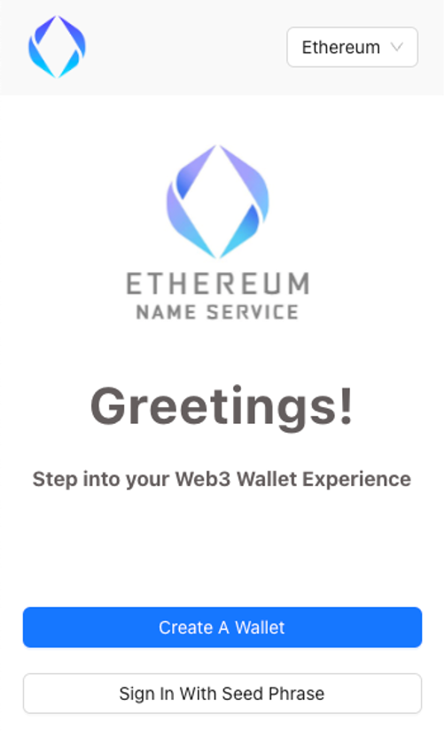
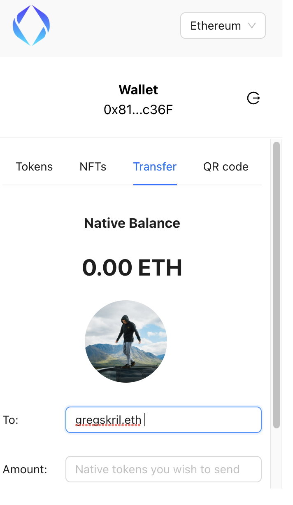
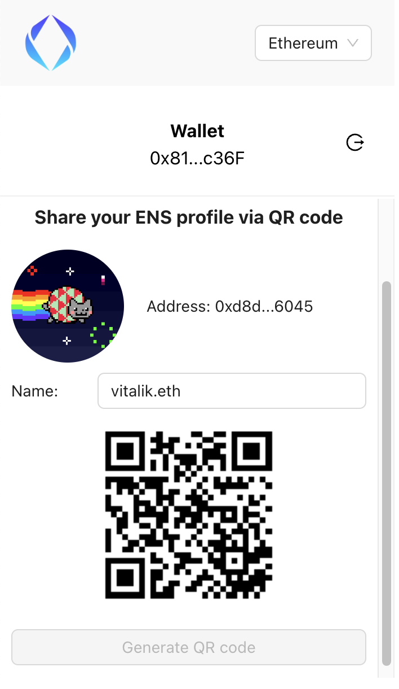

# Wallet-browser-extension

The Wallet Browser Extension is a versatile tool designed to simplify wallet management, facilitate transfers through ENS names, and generate QR codes for user profiles. The extension harnesses Moralis APIs to retrieve token and NFT information for the logged-in account.

# Why It Matters:
The Wallet Browser Extension is a valuable tool that bridges the gap between users and their cryptocurrency assets. Its user-friendly interface and advanced functionalities empower users to effortlessly manage their wallets, enhance their social presence through QR codes, and access essential token and NFT data, all from within their web browser. The extension aims to improve accessibility, security, and ease of use for users engaging with blockchain technology.

 

    

 

## Features

### Wallet Management

- **Create New Wallet:** Generate a new wallet
- **Load Existing Wallet:** Import an existing wallet for seamless access.

### ENS Resolution and Transfers

- **ENS Name Resolution:** Enter an ENS name to promptly obtain the corresponding address for transfers.
- **Recipient's Address:** When entering the recipient's address for transfers, remember to include a space after the address.
- ENS resolution works only on Ethereum Mainnet

 

    

 

### QR Code Generation

- **Generate QR Codes:** Create QR codes effortlessly, which can then be scanned to link to ENS profiles.

 

    

 

### Moralis API Integration

- **Token and NFT Information:** Utilize Moralis APIs to query comprehensive token and NFT data associated with the logged-in account.
- **Backend Setup:** To integrate Moralis APIs, you'll need an API key to facilitate seamless data retrieval.

### Supported Chains

The extension is compatible with the following chains:

- Ethereum Mainnet
- Polygon (MATIC) Mumbai Testnet
- Goerli Testnet
- Polygon Mainnet
- Avalanche Mainnet

## Future Enhancements:
- In future iterations, the project could incorporate features such as multi-chain support, enhanced security measures, integration with popular DeFi protocols, and a broader range of browser compatibility.

## Acknowledgments

- This project was inspired by Moralis Web3's Crypto Wallet Extension Tutorial.
- https://www.youtube.com/watch?v=2ZYtqX4rOAU 

